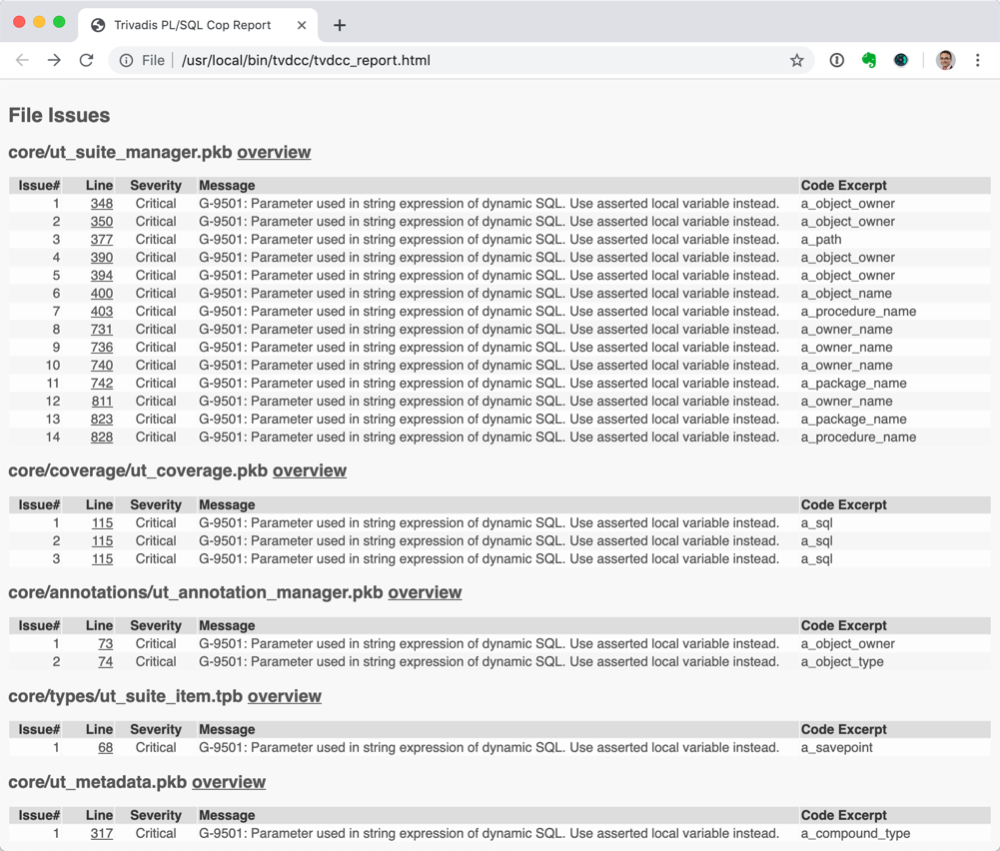
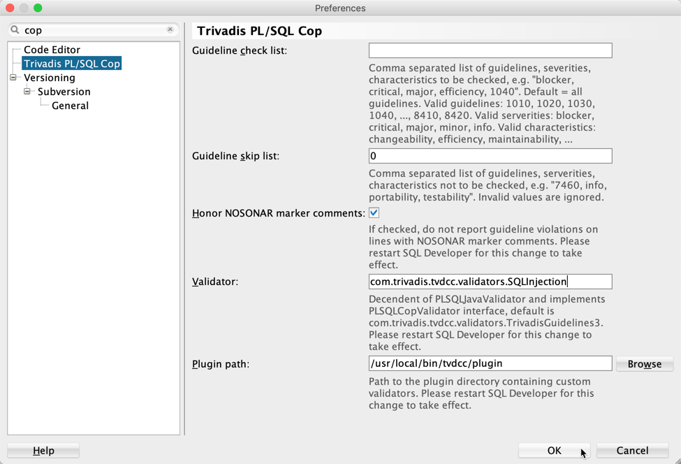
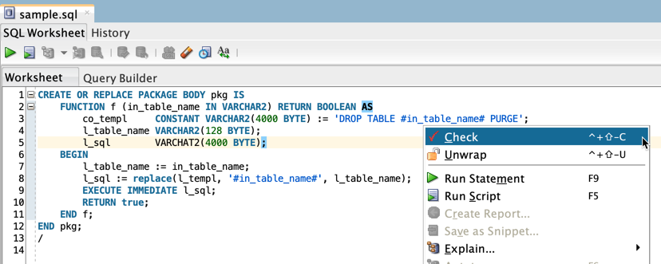

# PL/SQL Cop Validators

PL/SQL Cop supports custom validators. A validator must implement the PLSQLCopValidator Java interface and has to be a direct or indirect descendant of the PLSQLJavaValidator class.

You may use these validators as is or amend/extend them to suit your needs.

## Provided Validators

This project provides the following four custom validators in the package `com.trivadis.tvdcc.validators`:

Class | Description 
----- | -----------
TrivadisPlsqlNaming | Checks [Naming Conventions](https://trivadis.github.io/plsql-and-sql-coding-guidelines/2-naming-conventions/naming-conventions/#naming-conventions-for-plsql) of the Trivadis PL/SQL & SQL Coding Guidelines
GLP | Checks naming of global and local variables and parameters 
SQLInjection | Looks for SQL injection vulnerabilities, e.g. unasserted parameters in dynamic SQL
Hint | Looks for unknown hints and invalid table references
OverrideTrivadisGuidelines | Extends TrivadisGuidelines3 and overrides check for [G-1050](https://trivadis.github.io/plsql-and-sql-coding-guidelines/v3.6/4-language-usage/1-general/g-1050/).
TrivadisGuidelines3Plus | Combines the validators TrivadisPlsqlNaming, SQLInjection and OverrideTrivadisGuidelines. 

### TrivadisPlsqlNaming

This validator implements 15 guidelines to cover the chapter [2.2 Naming Conventions](https://trivadis.github.io/plsql-and-sql-coding-guidelines/2-naming-conventions/naming-conventions/#naming-conventions-for-plsql) of the Trivadis PL/SQL & SQL Coding Guidelines.

Guideline | Message
--------- | -----------
G-9001    | Always prefix global variables with 'g_'.
G-9002    | Always prefix local variables with 'l_'.
G-9003    | Always prefix cursors with 'c_'
G-9004    | Always prefix records with 'r_'.
G-9005    | Always prefix collection types (arrays/tables) with 't_'.
G-9006    | Always prefix objects with 'o_'.
G-9007    | Always prefix cursor parameters with 'p_'.
G-9008    | Always prefix in parameters with 'in_'.
G-9009    | Always prefix out parameters with 'out_'.
G-9010    | Always prefix in/out parameters with 'io_'.
G-9011    | Always prefix record type definitions with 'r_' and add the suffix '_type'.
G-9012    | Always prefix collection type definitions (arrays/tables) with 't_' and add the suffix '_type'.
G-9013    | Always prefix exceptions with 'e_'.
G-9014    | Always prefix constants with 'co_'.
G-9015    | Always prefix subtypes with 'type'.

These prefixes and suffixes can be customized by using a `TrivadisPlsqlNaming.properties` file. This file must be placed in the user's home directory (`$HOME` for Linux or macOS and `%HOMEDRIVE%%HOMEPATH%` for Windows). If a property is omitted it will fall back to the default value (see table above).

Here's an example of the `TrivadisPlsqlNaming.properties` file content using default values for all properties:

```
PREFIX_GLOBAL_VARIABLE_NAME = g_
PREFIX_LOCAL_VARIABLE_NAME = l_
PREFIX_CURSOR_NAME = c_
PREFIX_RECORD_NAME = r_
PREFIX_ARRAY_NAME = t_
PREFIX_OBJECT_NAME = o_
PREFIX_CURSOR_PARAMETER_NAME = p_
PREFIX_IN_PARAMETER_NAME = in_
PREFIX_OUT_PARAMETER_NAME = out_
PREFIX_IN_OUT_PARAMETER_NAME = io_
PREFIX_RECORD_TYPE_NAME = r_
SUFFIX_RECORD_TYPE_NAME = _type
PREFIX_ARRAY_TYPE_NAME = t_
SUFFIX_ARRAY_TYPE_NAME = _type
PREFIX_EXCEPTION_NAME = e_
PREFIX_CONSTANT_NAME = co_
SUFFIX_SUBTYPE_NAME = _type
```

### GLP

This is a simple validator to check the following naming convention guidelines:

Guideline | Message
--------- | -----------
G-9001    | Always prefix global variables with 'g_'.
G-9002    | Always prefix local variables with 'l_'.
G-9003    | Always prefix parameters with 'p_'.

This validator checks just these three guidelines. It does not extend the [Trivadis PL/SQL & SQL Coding Guidelines](https://trivadis.github.io/plsql-and-sql-coding-guidelines/).

### SQLInjection

This validator implements the following guideline:

Guideline | Message
--------- | -----------
G-9501    | Never use parameter in string expression of dynamic SQL. Use asserted local variable instead.

It looks for unasserted parameters used in [`EXECUTE IMMEDIATE`](https://docs.oracle.com/en/database/oracle/oracle-database/19/lnpls/EXECUTE-IMMEDIATE-statement.html#GUID-C3245A95-B85B-4280-A01F-12307B108DC8) statements and [`OPEN FOR`](https://docs.oracle.com/en/database/oracle/oracle-database/19/lnpls/OPEN-FOR-statement.html#GUID-EB7AF439-FDD3-4461-9E3F-B621E8ABFB96) statements. All parameters used in these statements must be asserted with one of the subprograms provided by [`DBMS_ASSERT`](https://docs.oracle.com/en/database/oracle/oracle-database/19/arpls/DBMS_ASSERT.html#GUID-27B4B484-7CD7-48FE-89A3-B630ADE1CB50).

#### Example (bad)

The input parameter `in_table_name` is copied to the local variable `l_table_name` and then used without an assert to build the `l_sql` variable. Hence, the execute immediate statement is considered vulnerable to SQL injection, e.g. by passing `DEPT CASCADE CONSTRAINTS`.

```sql
CREATE OR REPLACE PACKAGE BODY pkg IS
    FUNCTION f (in_table_name IN VARCHAR2) RETURN BOOLEAN AS
        co_templ     CONSTANT VARCHAR2(4000 BYTE) := 'DROP TABLE #in_table_name# PURGE';
        l_table_name VARCHAR2(128 BYTE);
        l_sql        VARCHAR2(4000 BYTE);
    BEGIN
        l_table_name := in_table_name;
        l_sql := replace(l_templ, '#in_table_name#', l_table_name);
        EXECUTE IMMEDIATE l_sql;
        RETURN true;
    END f;
END pkg;
```

#### Example (good)

SQL injection is not possible, because the input parameter `in_table_name` is checked/modified with [`sys.dbms_assert.enquote_name`](https://docs.oracle.com/en/database/oracle/oracle-database/19/arpls/DBMS_ASSERT.html#GUID-19E5AEEB-BB75-4B95-98C7-53921D2A9515).

```sql
CREATE OR REPLACE PACKAGE BODY pkg IS
    FUNCTION f (in_table_name IN VARCHAR2) RETURN BOOLEAN AS
        co_templ     CONSTANT VARCHAR2(4000 BYTE) := 'DROP TABLE #in_table_name# PURGE';
        l_table_name VARCHAR2(128 BYTE);
        l_sql        VARCHAR2(4000 BYTE);
    BEGIN
        l_table_name := sys.dbms_assert.enquote_name(in_table_name);
        l_sql := replace(l_templ, '#in_table_name#', l_table_name);
        EXECUTE IMMEDIATE l_sql;
        RETURN true;
    END f;
END pkg;
```

### Hint

This validator implements the following guidelines:

Guideline | Message
--------- | -----------
G-9600    | Never define more than one comment with hints.
G-9601    | Never use unknown hints.
G-9602    | Always use the alias name instead of the table name.
G-9603    | Never reference an unknown table/alias.

Only the first comment containing hints is considered by the optimizer, therefore all hints violating `G-9600` are treated as ordinary comments by the Oracle Database.

Using unknown hints might invalidate all subsequent hints. This happens when you use for example `NOLOGGING`. That's expected and not a bug. See MOS note 285285.1 or bug 8432870 for details. So, do not ignore `G-9601` violations.

There are various hints that reference a table. The validator checks if the reference is valid. If an alias is defined for a table, but the table name is used in the hint then a `G-9602` violation is reported. If the table reference in the hint is neither a table name nor an alias then a `G-9603` violation is thrown. These violations should not be ignored either. However, the vadiator does not consider the optional query block name in the hint, therfore some false positives are possible.

### OverrideTrivadisGuidelines

This validator shows how existing guideline checks can be overridden. 

The following guideline is overriden:

Guideline | Message
--------- | -----------
[G-1050](https://trivadis.github.io/plsql-and-sql-coding-guidelines/v3.6/4-language-usage/1-general/g-1050/) | Avoid using literals in your code.

Literals as part of a [Logger](https://github.com/OraOpenSource/Logger) package call are not reported (see also [issue 8](https://github.com/Trivadis/plsql-cop-validators/issues/8)).

### TrivadisGuidelines3Plus

This validator combines the validators

- [TrivadisPlsqlNaming](#trivadisplsqlnaming), 
- [SQLInjection](#sqlinjection), 
- [OverrideTrivadisGuidelines](#overridetrivadisguidelines) and
- [Hint](#hint). 

This way you can deal with an unbound number of validators without comproming the maintainablity.

## Use in PL/SQL Cop

1. Download PL/SQL Cop

   Download PL/SQL Cop from [here](https://www.salvis.com/blog/plsql-cop/). 

2. Install PL/SQL Cop

   - Uncompress the distributed PL/SQL Cop archive file (e.g. tvdcc-2.2.1.zip) into a folder of your choice (hereinafter referred to as `TVDCC_HOME`). I use `/usr/local/bin/tvdcc` for `TVDCC_HOME` on my MacBook Pro.

   - For Windows platforms only: Amend the settings for JAVA_HOME in the tvdcc.cmd file to meet your environment settings. Use at least a Java 7 runtime environment (JRE) or development kit (JDK).

   - Include `TVDCC_HOME` in your PATH environment variable for handy interactive usage.

   - Optionally copy your commercial license file into the `TVDCC_HOME` directory. For simplicity name the file tvdcc.lic.

3. Download Validator

   Download `validators.jar` from [here](https://github.com/Trivadis/cop-validators/releases).

4. Install Validator

   Copy the previously downloaded `validator.jar` into the `plugin` folder of your `TVDCC_HOME` folder.

5. Run PL/SQL Cop with Custom Validator

   Open a terminal window, change to the `TVDCC_HOME` directory and run the following command to all files in `$HOME/github/utPLSQL/source` with the custom validator `com.trivadis.tvdcc.validators.SQLInjection`:

   ```
   ./tvdcc.sh path=$HOME/github/utPLSQL/source validator=com.trivadis.tvdcc.validators.SQLInjection
   ```

   The `tvdcc_report.html` file contain the results. Here's an excerpt:

   

## Use in PL/SQL Cop for SQL Developer

1. Install PL/SQL Cop 

   As explained [above](README.md#use-in-plsql-cop).

2. Download PL/SQL Cop for SQL Developer

   Download PL/SQL Cop for SQL Developer from [here](https://www.salvis.com/blog/plsql-cop-for-sql-developer/).

3. Install PL/SQL Cop for SQL Developer

   - Start SQL Developer
   - Select `Check for Updates…` in the help menu.
   - Use the `Install From Local File(s)` option to install the previously downloaded `TVDCC_for_SQLDev-*.zip` file.
   - Restart SQL Developer

4. Configure Validator

   Configure the validator in SQL Developer as shown in the following screenshot:

   
   
5. Check Code

   Open the code to be checked in an editor and select `Check` from the context menu.

   

   The check result is shown by default at the bottom of your SQL Developer workspace.

   

## How to Build

1. Install PL/SQL Cop 

   As explained [above](README.md#use-in-plsql-cop).

2. Install Maven

   [Download](https://maven.apache.org/download.cgi) and install Apache Maven 3.6.1

3. Clone the cop-validators repository

   Clone or download this repository. 

4. Build `validators.jar`

   Open a terminal window in the cop-validators root folder and maven build by the following command

		mvn -Dtvdcc.basedir=/usr/local/bin/tvdcc clean package

	Amend the parameter `tvdcc.basedir` to match your `TVDCC_HOME` directory. This folder is used to reference PL/SQL Cop  jar files which are not available in public Maven repositories

## Issues
Please file your bug reports, enhancement requests, questions and other support requests within [Github's issue tracker](https://help.github.com/articles/about-issues/).

* [Questions](https://github.com/trivadis/plsql-cop-validators/issues?q=is%3Aissue+label%3Aquestion)
* [Open enhancements](https://github.com/trivadis/plsql-cop-validators/issues?q=is%3Aopen+is%3Aissue+label%3Aenhancement)
* [Open bugs](https://github.com/trivadis/plsql-cop-validators/issues?q=is%3Aopen+is%3Aissue+label%3Abug)
* [Submit new issue](https://github.com/trivadis/plsql-cop-validators/issues/new)

## License

The PL/SQL Cop Validators are licensed under the Creative Commons Attribution-NonCommercial-NoDerivs 3.0 Unported License. You may obtain a copy of the License at https://creativecommons.org/licenses/by-nc-nd/3.0/.
