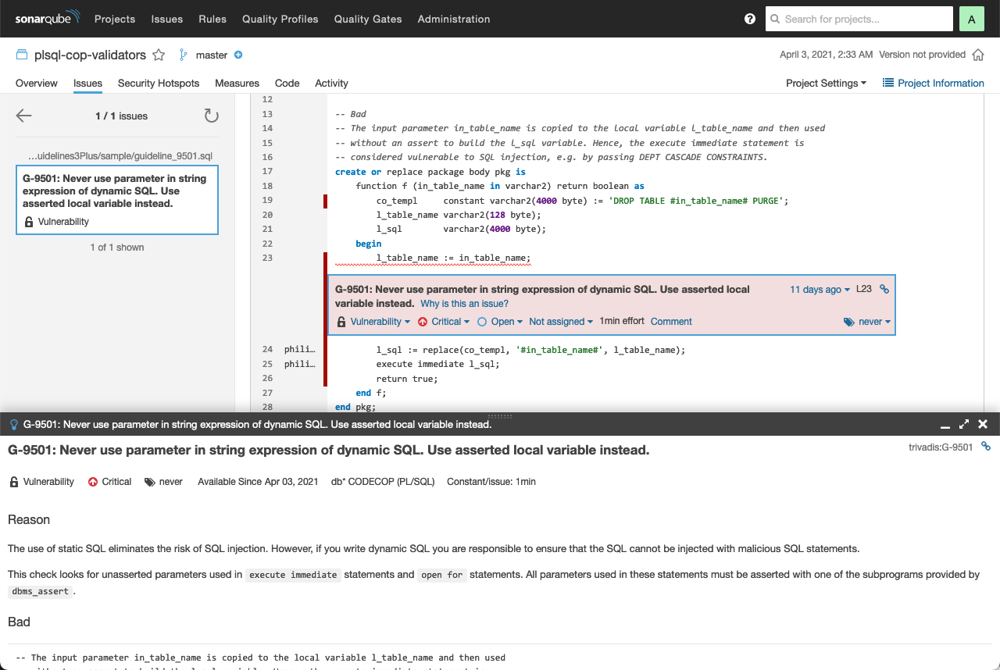

:warning: **Warning:** This project is no longer maintained! Therefore, it is in archive state!

# db* CODECOP Validators

db* CODECOP supports custom validators. A validator must implement the `PLSQLCopValidator` Java interface and has to be a direct or indirect descendant of the `PLSQLValidator` class. Such a class can be used in the command line utility and the SQL Developer extension. 

For SonarQube a `ValidationConfig` is required. A config defines the validator with its rules and quality profile for SonarQube. See [GLPValidatorConfig](src/main/java/com/trivadis/sonar/plugin/GLPValidatorConfig.java). The referenced XML files are generated based on the validator and the optional [sample guidelines](src/main/resources/GLP/sample).

You may use these validators as is or amend/extend them to suit your needs.

## Provided Validators

This project provides the following four custom validators in the package `com.trivadis.tvdcc.validators`:

Class | Description 
----- | -----------
TrivadisPlsqlNaming | Checks [Naming Conventions](https://trivadis.github.io/plsql-and-sql-coding-guidelines/v4.4/2-naming-conventions/naming-conventions/#naming-conventions-for-plsql) of the Trivadis PL/SQL & SQL Coding Guidelines
GLP | Checks naming of global and local variables and parameters 
SQLInjection | Looks for SQL injection vulnerabilities, e.g. unasserted parameters in dynamic SQL
Hint | Looks for unknown hints and invalid table references
OverrideTrivadisGuidelines | Extends TrivadisGuidelines3 and overrides check for [G-1050](https://trivadis.github.io/plsql-and-sql-coding-guidelines/v4.4/4-language-usage/1-general/g-1050/).
TrivadisGuidelines3Plus | Combines the validators TrivadisPlsqlNaming, SQLInjection and OverrideTrivadisGuidelines. 

### TrivadisPlsqlNaming

This validator implements 15 guidelines to cover the chapter [2.2 Naming Conventions](https://trivadis.github.io/plsql-and-sql-coding-guidelines/v4.4/2-naming-conventions/naming-conventions/#naming-conventions-for-plsql) of the Trivadis PL/SQL & SQL Coding Guidelines.

Guideline | Message
--------- | -----------
G-9101    | Always name global variables to match '^g_.+$'.
G-9102    | Always name local variables to match '^l_.+$'.
G-9103    | Always name cursors to match '^c_.+$'.
G-9104    | Always name records to match '^r_.+$'.
G-9105    | Always name collection types (arrays/tables) to match '^t_.+$'.
G-9106    | Always name objects to match '^o_.+$'.
G-9107    | Always name cursor parameters to match '^p_.+$'.
G-9108    | Always name in parameters to match '^in_.+$'.
G-9109    | Always name out parameters to match '^out_.+$'.
G-9110    | Always name in/out parameters to match '^io_.+$'.
G-9111    | Always name record type definitions to match '^r_.+_type$'.
G-9112    | Always name collection type definitions (arrays/tables) to match '^t_.+_type$'.
G-9113    | Always name exceptions to match '^e_.+$'.
G-9114    | Always name constants to match '^co_.+$'.
G-9115    | Always name subtypes to match '^.+_type$'.

These regular expressions can be customized by using a `TrivadisPlsqlNaming.properties` file. This file must be placed in the user's home directory (`$HOME` for Linux or macOS and `%HOMEDRIVE%%HOMEPATH%` for Windows). If a property is omitted it will fall back to the default value (see table above). Furthermore, you can use Java system properties to configure the naming conventions, e.g. `-DREGEX_CONSTANT_NAME=^k_.+$`. However, the `TrivadisPlsqlNaming.properties` file overrides system properties that where set when starting the JVM.

Here's an example of the `TrivadisPlsqlNaming.properties` file content using default values for all properties:

```
# Override default for TrivadisPlsqlNaming validator
REGEX_GLOBAL_VARIABLE_NAME = ^g_.+$
REGEX_LOCAL_VARIABLE_NAME = ^l_.+$
REGEX_CURSOR_NAME = ^c_.+$
REGEX_RECORD_NAME = ^r_.+$
REGEX_ARRAY_NAME = ^t_.+$
REGEX_OBJECT_NAME = ^o_.+$
REGEX_CURSOR_PARAMETER_NAME = ^p_.+$
REGEX_IN_PARAMETER_NAME = ^in_.+$
REGEX_OUT_PARAMETER_NAME = ^out_.+$
REGEX_IN_OUT_PARAMETER_NAME = ^io_.+$
REGEX_RECORD_TYPE_NAME = ^r_.+_type$
REGEX_ARRAY_TYPE_NAME = ^t_.+_type$
REGEX_EXCEPTION_NAME = ^e_.+$
REGEX_CONSTANT_NAME = ^co_.+$
REGEX_SUBTYPE_NAME = ^.+_type$
# Override defaults for TrivadisGuidelines3 validator
cop.1050.threshold = 2
cop.2185.threshold = 4
cop.2410.boolean.strings = true,false,t,f,0,1,2,yes,no,y,n,ja,nein,j,si,s,oui,non,o,l_true,l_false,co_true,co_false,co_numeric_true,co_numeric_false
cop.5050.threshold.from = 20000
cop.5050.threshold.to = 20999
cop.7210.threshold = 2000
```

If you are using the `TrivadisGuidelines3Plus` validator, the properties for the `TrivadisGuidelines3` validator can also be configured in this properties file.

### GLP

This is a simple validator to check the following naming convention guidelines:

Guideline | Message
--------- | -----------
G-9001    | Always prefix global variables with 'g_'.
G-9002    | Always prefix local variables with 'l_'.
G-9003    | Always prefix parameters with 'p_'.

This validator checks just these three guidelines. It does not extend the [Trivadis PL/SQL & SQL Coding Guidelines](https://trivadis.github.io/plsql-and-sql-coding-guidelines/).

### SQLInjection

This validator implements the following guideline:

Guideline | Message
--------- | -----------
G-9501    | Never use parameter in string expression of dynamic SQL. Use asserted local variable instead.

It looks for unasserted parameters used in [`EXECUTE IMMEDIATE`](https://docs.oracle.com/en/database/oracle/oracle-database/19/lnpls/EXECUTE-IMMEDIATE-statement.html#GUID-C3245A95-B85B-4280-A01F-12307B108DC8) statements and [`OPEN FOR`](https://docs.oracle.com/en/database/oracle/oracle-database/19/lnpls/OPEN-FOR-statement.html#GUID-EB7AF439-FDD3-4461-9E3F-B621E8ABFB96) statements. All parameters used in these statements must be asserted with one of the subprograms provided by [`DBMS_ASSERT`](https://docs.oracle.com/en/database/oracle/oracle-database/19/arpls/DBMS_ASSERT.html#GUID-27B4B484-7CD7-48FE-89A3-B630ADE1CB50).

See [example](src/main/resources/TrivadisGuidelines3Plus/sample/guideline_9501.sql)

### Hint

This validator implements the following guidelines:

Guideline | Message
--------- | -----------
G-9600    | Never define more than one comment with hints.
G-9601    | Never use unknown hints.
G-9602    | Always use the alias name instead of the table name.
G-9603    | Never reference an unknown table/alias.
G-9604    | Never use an invalid stats method.
G-9605    | Never use an invalid stats keyword.

Only the first comment containing hints is considered by the optimizer, therefore all hints violating `G-9600` are treated as ordinary comments by the Oracle Database.

Using unknown hints might invalidate all subsequent hints. This happens when you use for example `NOLOGGING`. That's expected and not a bug. See MOS note 285285.1 or bug 8432870 for details. So, do not ignore `G-9601` violations.

There are various hints that reference a table. The validator checks if the reference is valid. If an alias is defined for a table, but the table name is used in the hint then a `G-9602` violation is reported. If the table reference in the hint is neither a table name nor an alias then a `G-9603` violation is thrown. These violations should not be ignored either. 

However, the vadiator ignores the optional query block in the hint and assumes that all table references belong to the current query block. As a result some false positives are possible. Furthermore references to a table in a query block (e.g. `emp@qb1`) are not checked. This might lead to some false negatives.

The guidelines `G-9604` and `G-9605` check the validity of the `method` and `keyword` in the `table_stats` hint. 

### OverrideTrivadisGuidelines

This validator shows how existing guideline checks can be overridden. 

The following guideline is overriden:

Guideline | Message
--------- | -----------
[G-1050](https://trivadis.github.io/plsql-and-sql-coding-guidelines/v4.4/4-language-usage/1-general/g-1050/) | Avoid using literals in your code.

Literals as part of a [Logger](https://github.com/OraOpenSource/Logger) package call are not reported (see also [issue 8](https://github.com/Trivadis/plsql-cop-validators/issues/8)).

### TrivadisGuidelines3Plus

This validator combines the validators

- [TrivadisPlsqlNaming](#trivadisplsqlnaming), 
- [SQLInjection](#sqlinjection), 
- [Hint](#hint) and 
- [OverrideTrivadisGuidelines](#overridetrivadisguidelines)

This way you can deal with an unbound number of validators without comproming the maintainablity.

## Use in db* CODECOP

1. Download db* CODECOP Command Line

   Download db* CODECOP Command Line from [here](https://github.com/Trivadis/plsql-cop-cli/releases). 

2. Install db* CODECOP Command Line

   - Uncompress the distributed db* CODECOP archive file (e.g. tvdcc-4.x.x.zip) into a folder of your choice (hereinafter referred to as `TVDCC_HOME`). I use `$HOME/tvdcc` for `TVDCC_HOME` on my MacBook Pro.

   - For Windows platforms only: Amend the settings for JAVA_HOME in the tvdcc.cmd file to meet your environment settings. Use at least a Java 8 runtime environment (JRE) or development kit (JDK).

   - Include `TVDCC_HOME` in your PATH environment variable for handy interactive usage.

   - Optionally copy your commercial license file into the `TVDCC_HOME` directory. For simplicity name the file tvdcc.lic.

3. Download Custom Validators

   Download `sonar-plsql-cop-custom-validators-plugin-4.x.x.jar` from [here](https://github.com/Trivadis/cop-validators/releases).

4. Install Custom Validators

   Copy the previously downloaded jar file into the `plugin` folder of your `TVDCC_HOME` folder.

5. Run db* CODECOP with a Custom Validator

   Open a terminal window, change to the `TVDCC_HOME` directory and run the following command to all files in `$HOME/github/utPLSQL/source` with the custom validator `com.trivadis.tvdcc.validators.TrivadisGuidelines3Plus`:

   ```
   ./tvdcc.sh path=$HOME/github/utPLSQL/source validator=com.trivadis.tvdcc.validators.TrivadisGuidelines3Plus
   ```

   The `tvdcc_report.html` file contain the results. Here's an excerpt:

   

## Use in db* CODECOP for SQL Developer

1. Install db* CODECOP Command Line

   As explained [above](README.md#use-in-db*-codecop).

2. Download db* CODECOP for SQL Developer

   Download db* CODECOP for SQL Developer from [here](https://www.salvis.com/blog/plsql-cop-for-sql-developer/).

3. Install db* CODECOP for SQL Developer

   - Start SQL Developer
   - Select `Check for Updates…` in the help menu.
   - Use the `Install From Local File(s)` option to install the previously downloaded `TVDCC_for_SQLDev-*.zip` file.
   - Restart SQL Developer

4. Configure Validator

   Configure the validator in SQL Developer as shown in the following screenshot:

   
   
5. Check Code

   Open the code to be checked in an editor and select `Check` from the context menu.

   

   The check result is shown by default at the bottom of your SQL Developer workspace.

   


## Use in db* CODECOP for SonarQube

1. Install SonarQube

   [See documentation](https://docs.sonarqube.org/latest/setup/install-server/).

2. Install Standalone or Secondary Plugin

   [See documentation](https://github.com/Trivadis/plsql-cop-sonar/tree/main#installation).

3. Install Child Plugin (Custom Validator Plugin)

   Download the `sonar-plsql-cop-custom-validators-plugin-x.x.x.jar` from [releases](https://github.com/Trivadis/plsql-cop-validators/releases). Then copy it to the extensions/plugins folder of your [SonarQube](http://docs.sonarqube.org/display/SONAR/Installing+a+Plugin) installation and restart the SonarQube server.

4. Configure Validator Config Class

   Login as Administrator in SonarQube. Go to `Administration`. Select `General Settings` from `Configuration` and click on `db* CODECOP`. Type one of the following into the `Validator Config class` field:

   - com.trivadis.sonar.plugin.GLPValidatorConfig
   - com.trivadis.sonar.plugin.TrivadisGuidelines3PlusValidatorConfig
   
5. Restart SonarQube

   Select `System` in the `Administration` menu and click on `Restart Server`.

   **Important**: Starting with SonarQube 9.1, rules and quality profiles are cached to improve the startup time (see [SONAR-15237](https://sonarsource.atlassian.net/browse/SONAR-15237)). To apply changes to `Language Key` and `Validator Config class`, the PL/SQL specific plugins must be uninstalled and then reinstalled. Configuration changes are not affected by this process.

6. Run Analysis

   Start an analysis from the command line as follows (see [docs](https://docs.sonarqube.org/latest/analysis/scan/sonarscanner/) for more information):

   ```
   cd $HOME/github/trivadis/plsql-cop-validators/src/main/resources
   sonar-scanner -Dsonar.projectKey="plsql-cop-validators"
   ```

   By default the source code in the current directory is analyzed. Here's the result:

   

## How to Build

1. Install db* CODECOP Command Line

   As explained [above](README.md#use-in-db*-codecop).

2. Install Maven

   [Download](https://maven.apache.org/download.cgi) and install Apache Maven 3.8.6

3. Clone the cop-validators repository

   Clone or download this repository. 

3. Install the required db* CODECOP libraries

   These libraries are not available in public Maven repositories. However, they are part
   of the db* CODECOP Command Line installed in step 1. You need to install these libraries
   into your local Maven repository.

   Open a terminal window in the cop-validators root folder and run Run the following shell script:

      ./install_tvdcc_libs.sh

   The shell script expects to find the library `tvdcc.jar` in `$HOME/tvdcc`. If it is not there, pass the path to the directory as parameter to this script. For example

      ./install_tvdcc_libs.sh $HOME/tvdcc

4. Build validator jar file

   Open a terminal window in the cop-validators root folder and run the Maven build by the following command

		mvn clean package

## License

The db* CODECOP Validators are licensed under the Creative Commons Attribution-NonCommercial-NoDerivs 3.0 Unported License. You may obtain a copy of the License at https://creativecommons.org/licenses/by-nc-nd/3.0/.
